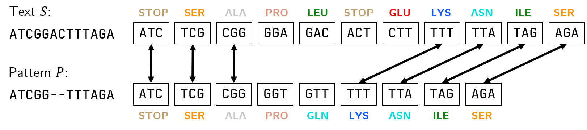

# Ideas of Greedy Alginment Algorithm

## Background

- The problem of DNA string alignment is well studied, but quite diverse.
- Current alignment algorithms use artificial different scoring schemes, often need to set a lot of parameters. (mismatch penalty, linear/affine gap penalty, etc.)
- To find the optimal alignment given scoring scheme, slow dynamic programming algorithms are applied.
- The "optimal" alignment that is found doesn't necessarily reflect the true mutations. So the long time spent on alignment is questionable.
- Some downstream analysis, e.g. variant calling, usually do re-alignment using their own scoring scheme. So very accurate alignment during the mapping process is unnecessary.

**Goal**: 
- to find a more unified and biologically meaningful way of measuring goodness of DNA alignment, and
- to design an efficient algorithm that distinguish good/bad alignment fast.

## Important concepts to introduce

We introduce the $k$-matching concept, taken from [BucketMap](https://github.com/GZHoffie/bucket-map):

> Given text $S$ and pattern $P$, The $k$-matching $M_k(S, P)$ is the longest common subsequence between the ordered sequences of $k$-mers in $S$ and in $P$.

Its idea is that we focus mainly on the part where two strings match rather than the part where there are errors.

It has the nice properties that

- Larger $|M_k(S, P)|$ implies more parts of the strings can be aligned together.
- It reflects similarity in biological funcionality between sequences, since matching between 3-mers can be viewed as matching between the translated amino acids of the part of DNA.
- It is related to the edit distance. We can prove that alignments with large $|M_k(S, P)|$ implies small edit distance, and also the other way around.

We use this definition in our algorithm because:

- It justifies out "eliminate short 0's" idea. Since we are considering matching of $k$-mers, we eliminate short matches that are shorter than $k$. So greatly reduce the length of highways.

Now our goal for the alignment algorithm in the mapper becomes:

> Given text $S$ and pattern $P$, judge between the case
> - $M_k(S,P)\geq m$ (ACCEPT), or
> - $M_k(S,P)<0.632m$ (REJECT).

where $m$ is a threshold judging whether $S$ and $P$ can be well-aligned.

We design a **greedy** algorithm that calculates an approximation of the $k$-matching between two strings $\hat{M}_k(S,P)$, that is close to $M_k(S,P)$.

## Proof of Correctness

By greedily selecting $k$ "longest sequence of 0's", we can prove the following statements.

1. It is never going to overestimate $|M_k(S, P)|$. So always REJECTs if $|M_k(S, P)|<0.632 m$. Zero false positive rate.

   This proof is mostly trivial.
2. If the alignment is good, i.e. $|M_k(S, P)|\geq m$, then the approximation $|\hat{M}_k(S,P)|\geq (1-1/e)m$.

   I realize that this is actually a [maximum coverage problem](https://en.wikipedia.org/wiki/Maximum_coverage_problem)! Which is NP-complete! 简单问题复杂化！This claim can be proved by the greedy algorithm used to solve this problem (I haven't checked carefully yet).

